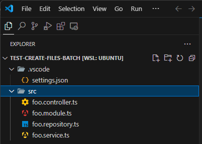

# Create Files Batch

Create Files Batch is a VSCode extension designed to streamline file creation by enabling the batch creation of files with a common name but varying suffixes or extensions. This extension is ideal for repetitive setups, such as creating multiple related files in the same folder or setting up new modules with similar structures (e.g., for a new use case in a backend).

## Key Features

- Batch file creation with customizable file suffixes.
- Templates in settings.json allow pre-defining common file structures.
- On-the-fly configuration for custom file setups.

## Installation

Simply install the extension from the Visual Studio Code Marketplace and start using it!

## Getting Started

This guide shows how to set up and use Create Files Batch with both predefined templates and custom options.

### Example: NestJS Use Case

Suppose you frequently add new "use case" files in a NestJS backend. Here’s how to automate this structure with a template:

1. Add a Template to `settings.json` file in `.vscode` folder

   Open your settings.json and define a template with a label, description, and file configurations:

   ```json
   {
     "create-files-batch": {
       "templates": [
         {
           "label": "NestJS use case",
           "description": "Creates all the needed files for a new use case in the application.",
           "files": [
             { "suffix": ".controller.ts" },
             { "suffix": ".service.ts" },
             { "suffix": ".repository.ts" },
             {
               "suffix": ".module.ts",
               "content": [
                 "import { Module } from '@nestjs/common';",
                 "",
                 "@Module({",
                 "  controllers: [],",
                 "  providers: [],",
                 "})",
                 "export class Module {}"
               ]
             }
           ]
         }
       ]
     }
   }
   ```

2. Create Files Using the Template

   1. Open the Command Palette (`Ctrl+Shift+P` or `Cmd+Shift+P`) and search for `Create: Multiple Files...`.
   2. If more than one workspace is open, select the workspace to create files in.
   3. Select the "_NestJS use case_" template from the list.
   4. Specify the destination path.
   5. Enter a common file name prefix. For example, entering "_auth_" will create:
      - `auth.controller.ts`
      - `auth.service.ts`
      - `auth.repository.ts`
      - `auth.module.ts`

### Creating Files Without a Predefined Template

1. Open the Command Palette and select `Create: Multiple Files...`.
2. If prompted, choose the workspace.
3. Select the built-in "_Custom_" option.
4. Manually specify the suffixes you’d like to use.
5. Follow the remaining prompts to choose a destination and enter the prefix.

### Creating Files Through Context Menu

1. Right click at the destination folder to open context menu.
2. Select the `Create: Multiple Files...` option.
3. Follow the prompts and steps and fill in the as desired.

### Screenshots

#### Command Palette

1. `Create: Multiple Files...` command:

<p align="center">
  
</p>

2. Workspace selection:

<p align="center">
  
</p>

3. Template selection:

<p align="center">
  
</p>

4. Destination folder specification:

<p align="center">
  
</p>

5. File name specification:

<p align="center">
  
</p>

#### Context Menu

1. Open Context Menu:

<p align="center">
  
</p>

2. Template selection:

<p align="center">
  
</p>

3. File name specification:

<p align="center">
  
</p>

4. Created files:

<p align="center">
  
</p>

### Additional Configuration Options

You can define multiple templates in your settings.json for different use cases, each with a unique label, description, and file structure.

```json
{
  "create-files-batch": {
    "templates": [
      {
        "label": "NestJS use case",
        "description": "Creates all the needed files for a new use case in the application.",
        "files": [
          {
            "suffix": ".controller.ts",
            "content": [
              "import { Controller } from '@nestjs/common';",
              "",
              "@Controller('foo')",
              "export class FooController {",
              " constructor() {",
              " }",
              "}"
            ]
          },
          {
            "suffix": ".service.ts",
            "content": [
              "import { Injectable, Logger } from '@nestjs/common';",
              "import { FooRepository } from './foo.repository';",
              "",
              "@Injectable()",
              "export class FooService {",
              "  private logger = new Logger(FooService.name);",
              "  constructor(private readonly fooRepository: FooRepository) {}",
              "}"
            ]
          },
          {
            "suffix": ".repository.ts",
            "content": [
              "import { Repository } from 'typeorm';",
              "import { InjectRepository } from '@nestjs/typeorm';",
              "",
              "export class FooRepository extends Repository<Entity> {",
              "  constructor(",
              "    @InjectRepository(User)",
              "    private repository: Repository<Entity>,",
              "  ) {",
              "    super(",
              "      repository.target,",
              "      repository.manager,",
              "      repository.queryRunner,",
              "    );",
              "  }",
              "}"
            ]
          },
          {
            "suffix": ".module.ts",
            "content": [
              "import { Module } from '@nestjs/common';",
              "import { FooController } from './foo.controller';",
              "import { FooRepository } from './foo.repository';",
              "import { FooService } from './foo.service';",
              "",
              "@Module({",
              "  controllers: [FooController],",
              "  providers: [FooRepository, FooService],",
              "})",
              "export class FooModule {}"
            ]
          }
        ]
      },
      {
        "label": "New NestJS use case with test files",
        "description": "Creates all the needed files for a new use case in the application including test files.",
        "files": [
          ".controller.ts",
          ".controller.spec.ts",
          ".service.ts",
          ".service.spec.ts",
          ".repository.ts",
          ".repository.spec.ts",
          ".module.ts"
        ]
      }
    ]
  }
}
```

## Attributions

- [Multiple layer icons created by pancaza - Flaticon](https://www.flaticon.com/free-icons/multiple-layer)
